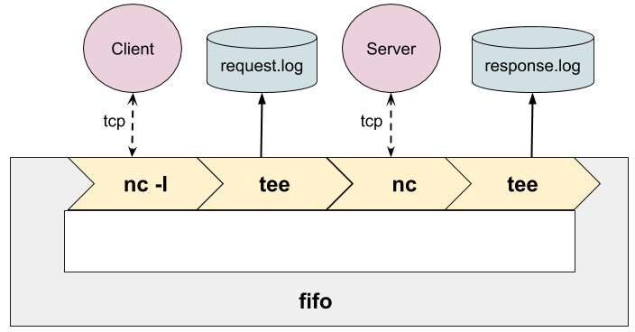

# Requirements
- docker(docker-compose)
- mysql-client
- redis-client
- nc
- tee
- curl

# How to use
## Set up
```bash
docker-compose up -d
mkfifo fifo
touch request.log response.log
tail -f request.log # tail another terminal
tail -f response.log # tail another terminal
```

- mysql listen on 3306
- redis listen on 6379
- nginx listen on 8888

## HTTP
```bash
nc -l 11111 < fifo | tee request.log | nc localhost 8888 | tee fifo > response.log # tail log file
curl localhost:11111

nc -l 11111 < fifo | tee request.log | nc localhost 8888 | tee fifo > response.log
open http://localhost:11111
```
## Redis
```bash
nc -l 11111 < fifo | tee request.log | nc localhost 6379 | tee fifo > response.log
redis-cli -p 11111 
```

try `ping`, `set name hoge`, `get name`

## Mysql
```bash
nc -l 11111 < fifo | tee request.log | nc localhost 3306 | tee fifo > response.log
mysql -h 127.0.0.1 -u root -P 11111 -p # press just enter when asked password (root password is empty)
```

try `show databases`, `create database hoge`

# Architecture


# Reference
https://notes.tweakblogs.net/blog/7955/using-netcat-to-build-a-simple-tcp-proxy-in-linux.html
